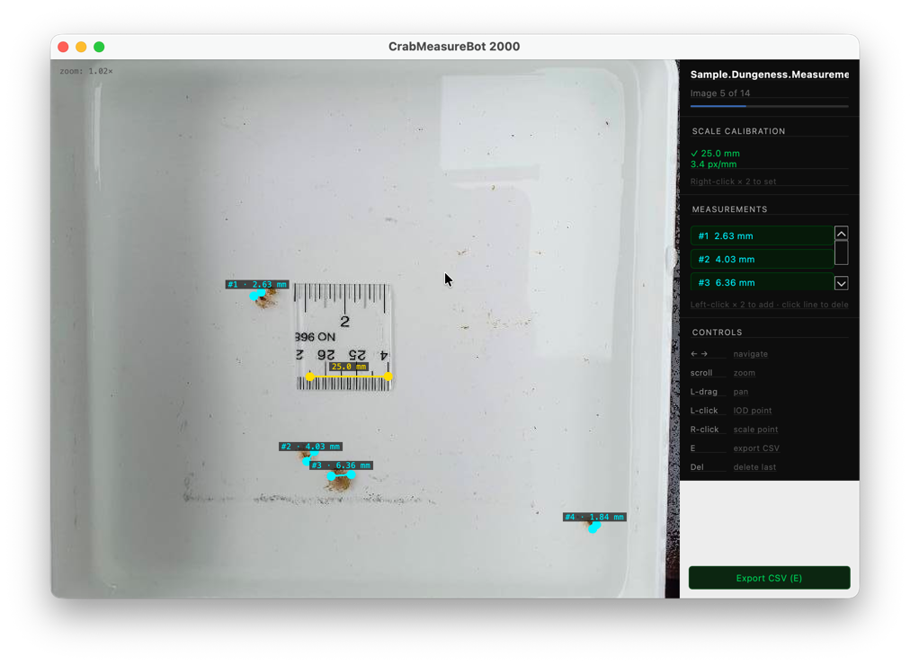

# CrabMeasureBot 2000



A desktop GUI for manually measuring interocular distances (IOD) from crab larvae photos. Open a directory of images, calibrate a scale reference from a ruler visible in each photo, then draw measurement segments between eye points. All data persists automatically to a local SQLite database and can be exported to CSV.

## Requirements

- Python 3.13+
- [uv](https://docs.astral.sh/uv/)

## Installation

```bash
uv sync
```

## Running

```bash
uv run crab-measurebot
```

On launch, a dialog prompts you to select a directory of images. The app supports `.jpg`, `.jpeg`, `.png`, `.tif`, `.tiff`, and `.bmp` files. A SQLite database (`measurebot.db`) is created automatically in the chosen directory to persist all scale calibrations and measurements.

## Workflow

### 1. Calibrate the scale

Each image should contain a ruler or reference object of known size. Before measuring, set the scale:

1. **Right-click** on one end of the ruler — this begins the scale segment.
2. **Right-click** on the other end — a dialog prompts you to enter the segment length in centimetres.

The yellow scale line appears on the image once set. Scale calibration is stored per-image and persists across sessions.

### 2. Measure interocular distance

With the scale set:

1. **Left-click** on one eye point — this begins the measurement segment.
2. **Left-click** on the other eye point — the distance in millimetres is calculated and saved immediately.

Each measurement appears as a numbered cyan line with its distance label. Multiple measurements can be added to a single image.

### 3. Navigate images

Use **← →** (arrow keys) to move between images in the directory. Progress is shown in the right panel.

### 4. Export results

Press **E** or click **Export CSV** to save all measurements across all images to a `.csv` file. The export contains one row per measurement with columns: `image_path`, `measurement_id`, `x1`, `y1`, `x2`, `y2`, `distance_mm`.

## Controls

| Input | Action |
|---|---|
| `← →` | Navigate between images |
| Scroll wheel / pinch | Zoom in/out |
| Left-drag | Pan |
| Left-click × 2 | Add IOD measurement |
| Right-click × 2 | Set scale calibration |
| Click on a line | Delete that measurement or scale |
| `Del` / `Backspace` | Delete the most recent measurement |
| `E` | Export all measurements to CSV |

## Data

Measurements are stored in `measurebot.db` (SQLite) inside the opened image directory. All coordinates are saved in original image pixels, independent of zoom or pan state. The database is created on first run and updated in real time as you work — no manual save is required.
