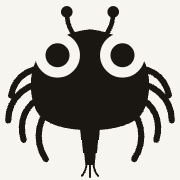

<div align="center">
  

# CrabMeasureBot 2000

Manual interocular distance measurement for crab larvae photos

[](https://github.com/HakaiInstitute/crab-measurebot-2000/releases)
[](#)
[](https://www.python.org/)
</div>

Open a directory of crab larvae images, calibrate a pixel-to-mm scale from a ruler visible in each photo, then click to
measure interocular distances (IOD). All data auto-saves to a local SQLite database and exports to CSV.


## Quick Start

Head to the [Releases page](https://github.com/HakaiInstitute/crab-measurebot-2000/releases) to download the latest release for your operating system.

## Workflow

### 1. Calibrate the scale

Each image should contain a ruler or reference object of known size. Before measuring, set the scale:

1. **Right-click** on one end of the ruler — this begins the scale segment.
2. **Right-click** on the other end — a dialog prompts you to enter the segment length in centimetres.

The yellow scale line appears on the image once set. Scale calibration is stored per-image and persists across sessions.

### 2. Measure interocular distance

With the scale set:

1. **Left-click** on one eye point — this begins the measurement segment.
2. **Left-click** on the other eye point — the distance in millimetres is calculated and saved immediately.

Each measurement appears as a numbered cyan line with its distance label. Multiple measurements can be added to a single
image.

### 3. Navigate images

Use **← →** (arrow keys) to move between images in the directory. Progress is shown in the right panel.

### 4. Export results

Press **E** or click **Export CSV** to save all measurements across all images to a `.csv` file. The export contains one
row per measurement with columns: `image_path`, `measurement_id`, `x1`, `y1`, `x2`, `y2`, `distance_mm`.

## Controls

| Input                | Action                             |
|----------------------|------------------------------------|
| `← →`                | Navigate between images            |
| Scroll wheel / pinch | Zoom in/out                        |
| Left-drag            | Pan                                |
| Left-click × 2       | Add IOD measurement                |
| Right-click × 2      | Set scale calibration              |
| Click on a line      | Delete that measurement or scale   |
| `Del` / `Backspace`  | Delete the most recent measurement |
| `E`                  | Export all measurements to CSV     |

## For Developers

**Requirements:** Python 3.13+, [uv](https://docs.astral.sh/uv/)

**Install dependencies:**

```bash
uv sync
```

**Run the app:**

```bash
uv run crab-measurebot
```

## Data

Measurements are stored in `measurebot.db` (SQLite) inside the opened image directory. All coordinates are saved in
original image pixels, independent of zoom or pan state. The database is created on first run and updated in real time
as you work — no manual save is required.
